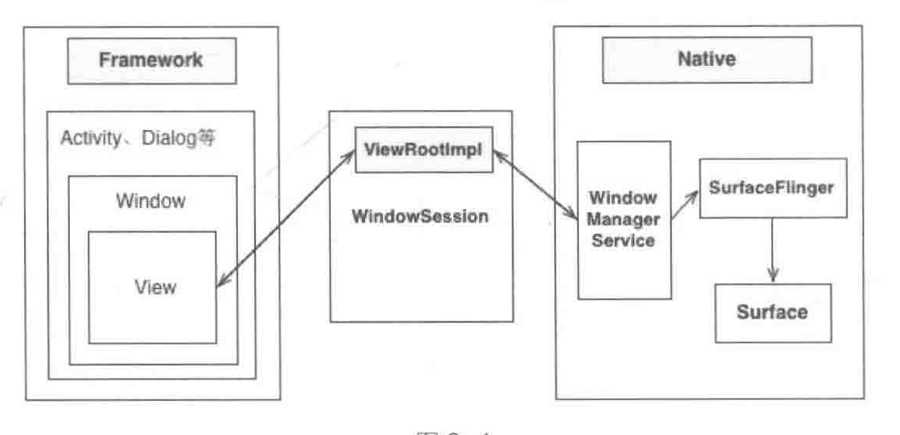

# 1、 Builder 模式角色简介
* Product 产品类----产品的抽象类； 
* Builder----抽象Builder类，规范产品的组建，一般是由子类实现具体的组建过程;
* ConcreteBuilder----具体的Builder类；
* Director----统一组装过程；

Builder的简单实现可以查看Builder的代码  （Android源码版本4.1.1）

# 2、Android系统的 Builder 设计模式分析：
## 1、AlertDialog源码
        public class AlertDialog extends Dialog implements DialogInterface{
            private AlertController mAlert;
            // 构造函数，
            protected AlertDialog(Context context, int theme) {
                this(context, theme, true);
            }
            //实际构造的是AlertController对象
            AlertDialog(Context context, int theme, boolean createContextWrapper) {
                super(context, resolveDialogTheme(context, theme), createContextWrapper);
                mWindow.alwaysReadCloseOnTouchAttr();
                mAlert = new AlertController(getContext(), this, getWindow());
            }
            
            //实际调用的对象都是mAlert对象
            @Override
            public void setTitle(CharSequence title) {
                super.setTitle(title);
                mAlert.setTitle(title);
            }
                  
            public void setMessage(CharSequence message) {
                mAlert.setMessage(message);
            }
        
            /**
             * Set the view to display in that dialog.
             */
            public void setView(View view) {
                mAlert.setView(view);
            }
            
            // 创建视图的
            @Override
            protected void onCreate(Bundle savedInstanceState) {
                super.onCreate(savedInstanceState);  //父类是一个空的实现
                mAlert.installContent();             //
            }
            
            //构造者对象
            public static class Builder {
                //构造对象需要的参数，使用构造者将创建需要的参数存储到P对象中；
                private final AlertController.AlertParams P;
                private int mTheme;
                //构造者对象的构造函数，
                public Builder(Context context) {
                    this(context, resolveDialogTheme(context, 0));
                }
                public Builder(Context context, int theme) {
                    P = new AlertController.AlertParams(new ContextThemeWrapper(
                            context, resolveDialogTheme(context, theme)));
                    mTheme = theme;
                }
                //存储参数，然后再将构造者对象返回，方便链式调用。
                public Builder setTitle(int titleId) {
                    P.mTitle = P.mContext.getText(titleId);
                    return this;
                }
                
                public Builder setTitle(CharSequence title) {
                    P.mTitle = title;
                    return this;
                }
                
                //根据参数创建AlertDialog对象，
                public AlertDialog create() {
                    //调用AlertDialog的构造函数，
                    final AlertDialog dialog = new AlertDialog(P.mContext, mTheme, false);
                    //传递参数
                    P.apply(dialog.mAlert);
                    dialog.setCancelable(P.mCancelable);
                    if (P.mCancelable) {
                        dialog.setCanceledOnTouchOutside(true);
                    }
                    dialog.setOnCancelListener(P.mOnCancelListener);
                    if (P.mOnKeyListener != null) {
                        dialog.setOnKeyListener(P.mOnKeyListener);
                    }
                    return dialog;
                }
                
                //调用Dialog的show方法。
                public AlertDialog show() {
                    AlertDialog dialog = create();
                    dialog.show();
                    return dialog;
                }
            }
        
        }
        
## 2、AlertParams的apply方法
        public class AlertController {
            public static class AlertParams {
                //将参数信息传给dialog对象。
                public void apply(AlertController dialog) {
                    if (mCustomTitleView != null) {
                        dialog.setCustomTitle(mCustomTitleView);
                    } else {
                        if (mTitle != null) {
                            dialog.setTitle(mTitle);
                        }
                        if (mIcon != null) {
                            dialog.setIcon(mIcon);
                        }
                        if (mIconId >= 0) {
                            dialog.setIcon(mIconId);
                        }
                    }
                    if (mMessage != null) {
                        dialog.setMessage(mMessage);
                    }
                    if (mPositiveButtonText != null) {
                        dialog.setButton(DialogInterface.BUTTON_POSITIVE, mPositiveButtonText,
                                mPositiveButtonListener, null);
                    }
                    if (mNegativeButtonText != null) {
                        dialog.setButton(DialogInterface.BUTTON_NEGATIVE, mNegativeButtonText,
                                mNegativeButtonListener, null);
                    }
                    if (mNeutralButtonText != null) {
                        dialog.setButton(DialogInterface.BUTTON_NEUTRAL, mNeutralButtonText,
                                mNeutralButtonListener, null);
                    }
                    if (mForceInverseBackground) {
                        dialog.setInverseBackgroundForced(true);
                    }
                    // For a list, the client can either supply an array of items or an
                    // adapter or a cursor
                    if ((mItems != null) || (mCursor != null) || (mAdapter != null)) {
                        createListView(dialog);
                    }
                    if (mView != null) {
                        if (mViewSpacingSpecified) {
                            dialog.setView(mView, mViewSpacingLeft, mViewSpacingTop, mViewSpacingRight,
                                    mViewSpacingBottom);
                        } else {
                            dialog.setView(mView);
                        }
                    }
                    
                    /*
                    dialog.setCancelable(mCancelable);
                    dialog.setOnCancelListener(mOnCancelListener);
                    if (mOnKeyListener != null) {
                        dialog.setOnKeyListener(mOnKeyListener);
                    }
                    */
                }
            
            }
        }
        
## 3、Dialog的show方法分析
    public class Dialog implements DialogInterface, Window.Callback,
        KeyEvent.Callback, OnCreateContextMenuListener {
            //...
            public void show() {
                //1、已经是显示状态，返回
                if (mShowing) {
                    if (mDecor != null) {
                        if (mWindow.hasFeature(Window.FEATURE_ACTION_BAR)) {
                            mWindow.invalidatePanelMenu(Window.FEATURE_ACTION_BAR);
                        }
                        mDecor.setVisibility(View.VISIBLE);
                    }
                    return;
                }
        
                mCanceled = false;
                // 2、调用onCreate() 方法
                if (!mCreated) {
                    dispatchOnCreate(null);
                }
        
                onStart();
                //3、 获得Decor视图
                mDecor = mWindow.getDecorView();
                
                if (mActionBar == null && mWindow.hasFeature(Window.FEATURE_ACTION_BAR)) {
                    mActionBar = new ActionBarImpl(this);
                }
                // 4、 获得布局参数
                WindowManager.LayoutParams l = mWindow.getAttributes();
                if ((l.softInputMode & WindowManager.LayoutParams.SOFT_INPUT_IS_FORWARD_NAVIGATION) == 0) {
                    WindowManager.LayoutParams nl = new WindowManager.LayoutParams();
                    nl.copyFrom(l);
                    nl.softInputMode |= WindowManager.LayoutParams.SOFT_INPUT_IS_FORWARD_NAVIGATION;
                    l = nl;
                }
        
                try {
                    //  将mDecor添加到WindowManager中，
                    mWindowManager.addView(mDecor, l);
                    mShowing = true;
                    // 发送一个显示Dialog的消息
                    sendShowMessage();
                } finally {
                }
            }
        }
这是一系列典型的声明周期函数。
在onCreate方法主要是mAlert.installContent();

    public class AlertController {
        public void installContent() {
            /* We use a custom title so never request a window title */
            mWindow.requestFeature(Window.FEATURE_NO_TITLE);
            
            if (mView == null || !canTextInput(mView)) {
                mWindow.setFlags(WindowManager.LayoutParams.FLAG_ALT_FOCUSABLE_IM,
                        WindowManager.LayoutParams.FLAG_ALT_FOCUSABLE_IM);
            }
            //调用mWindow的setContentView方法设置布局 这个和Activity的setContentView方法一样，mAlertDialogLayout的布局对象
            // mAlertDialogLayout = a.getResourceId(com.android.internal.R.styleable.AlertDialog_layout,com.android.internal.R.layout.alert_dialog);
            mWindow.setContentView(mAlertDialogLayout);
            setupView();
        }
        //
        private void setupView() {
            LinearLayout contentPanel = (LinearLayout) mWindow.findViewById(R.id.contentPanel);
            //内容布局，
            setupContent(contentPanel);
            boolean hasButtons = setupButtons();
            
            LinearLayout topPanel = (LinearLayout) mWindow.findViewById(R.id.topPanel);
            TypedArray a = mContext.obtainStyledAttributes(
                    null, com.android.internal.R.styleable.AlertDialog, com.android.internal.R.attr.alertDialogStyle, 0);
            boolean hasTitle = setupTitle(topPanel);
                
            View buttonPanel = mWindow.findViewById(R.id.buttonPanel);
            if (!hasButtons) {
                buttonPanel.setVisibility(View.GONE);
                mWindow.setCloseOnTouchOutsideIfNotSet(true);
            }
            
            // 自定义布局
            FrameLayout customPanel = null;
            if (mView != null) {
                customPanel = (FrameLayout) mWindow.findViewById(R.id.customPanel);
                FrameLayout custom = (FrameLayout) mWindow.findViewById(R.id.custom);
                custom.addView(mView, new LayoutParams(MATCH_PARENT, MATCH_PARENT));
                if (mViewSpacingSpecified) {
                    custom.setPadding(mViewSpacingLeft, mViewSpacingTop, mViewSpacingRight,
                            mViewSpacingBottom);
                }
                if (mListView != null) {
                    ((LinearLayout.LayoutParams) customPanel.getLayoutParams()).weight = 0;
                }
            } else {
                mWindow.findViewById(R.id.customPanel).setVisibility(View.GONE);
            }
            
            /* Only display the divider if we have a title and a 
             * custom view or a message.
             */
            if (hasTitle) {
                View divider = null;
                if (mMessage != null || mView != null || mListView != null) {
                    divider = mWindow.findViewById(R.id.titleDivider);
                } else {
                    divider = mWindow.findViewById(R.id.titleDividerTop);
                }
    
                if (divider != null) {
                    divider.setVisibility(View.VISIBLE);
                }
            }
            
            setBackground(topPanel, contentPanel, customPanel, hasButtons, a, hasTitle, buttonPanel);
            a.recycle();
        }
        
    }

# 2、深入了解WindowManager
 不单是Dialog，所有需要显示在屏幕上的内容（包括Activity）都是通过WindowManager来操作的，看来WindowManager是一个非常重要的子系统，
 这就是我们常说的WMS(WindowManagerService)。在ContextImpl中的static代码块中，注册所有的服务，包括WindowManagerService.
    
    registerService(WINDOW_SERVICE, new ServiceFetcher() {
                public Object getService(ContextImpl ctx) {
                    return WindowManagerImpl.getDefault(ctx.mPackageInfo.mCompatibilityInfo);
                }});
                
来看一下WindowManagerImpl.getDefault()方法的详细实现：

    public static WindowManager getDefault(CompatibilityInfoHolder compatInfo) {
        return new CompatModeWrapper(sWindowManager, compatInfo);
    }
    
返回的是新建的CompatModeWrapper对象，

        CompatModeWrapper(WindowManager wm, CompatibilityInfoHolder ci) {
            mWindowManager = wm instanceof CompatModeWrapper
                    ? ((CompatModeWrapper)wm).mWindowManager : (WindowManagerImpl)wm;

            // Use the original display if there is no compatibility mode
            // to apply, or the underlying window manager is already a
            // compatibility mode wrapper.  (We assume that if it is a
            // wrapper, it is applying the same compatibility mode.)
            if (ci == null) {
                mDefaultDisplay = mWindowManager.getDefaultDisplay();
            } else {
                //mDefaultDisplay = mWindowManager.getDefaultDisplay();
                mDefaultDisplay = Display.createCompatibleDisplay(
                        mWindowManager.getDefaultDisplay().getDisplayId(), ci);
            }

            mCompatibilityInfo = ci;
        }

在上面的分析中，我们看到了WindowManager是如何实现的，也就是WindowManagerImpl。那么Dialog是如何获取到WindowManager的呢？
WindowManager是注册到ContextImpl中的，而getSystemService也是Context定义的接口，因此，需要先从Dialog的构造函数进行分析。

    final Context mContext;
    final WindowManager mWindowManager;
    Window mWindow;
    Dialog(Context context, int theme, boolean createContextWrapper) {
        if (theme == 0) {
            TypedValue outValue = new TypedValue();
            context.getTheme().resolveAttribute(com.android.internal.R.attr.dialogTheme,
                    outValue, true);
            theme = outValue.resourceId;
        }

        mContext = createContextWrapper ? new ContextThemeWrapper(context, theme) : context;
        mWindowManager = (WindowManager)context.getSystemService(Context.WINDOW_SERVICE);
        Window w = PolicyManager.makeNewWindow(mContext);
        mWindow = w;
        w.setCallback(this);
        w.setWindowManager(mWindowManager, null, null);
        w.setGravity(Gravity.CENTER);
        mListenersHandler = new ListenersHandler(this);
    }

可以看到最终是通过Window对象的setWindowManager函数将Window对象与WindowManager建立了联系，具体实现：
    
    public void setWindowManager(WindowManager wm, IBinder appToken, String appName,
            boolean hardwareAccelerated) {
        mAppToken = appToken;
        mAppName = appName;
        if (wm == null) {
            wm = WindowManagerImpl.getDefault();
        }
        mWindowManager = new LocalWindowManager(wm, hardwareAccelerated);
    }
    
最后一句调用的是new LocalWindowManager()

    LocalWindowManager(WindowManager wm, boolean hardwareAccelerated) {
        super(wm, getCompatInfo(mContext));
        mHardwareAccelerated = hardwareAccelerated ||
             SystemProperties.getBoolean(PROPERTY_HARDWARE_UI, false);
    }
    

    public class WindowManagerImpl implements WindowManager {
        private View[] mViews;
        private ViewRootImpl[] mRoots;
        private WindowManager.LayoutParams[] mParams;
        private boolean mNeedsEglTerminate;
    
        private Runnable mSystemPropertyUpdater = null;
    
        private final static Object sLock = new Object();
        private final static WindowManagerImpl sWindowManager = new WindowManagerImpl();
        private final static HashMap<CompatibilityInfo, WindowManager> sCompatWindowManagers
                = new HashMap<CompatibilityInfo, WindowManager>();
                
        private void addView(View view, ViewGroup.LayoutParams params,
                CompatibilityInfoHolder cih, boolean nest) {
            if (false) Log.v("WindowManager", "addView view=" + view);
    
            if (!(params instanceof WindowManager.LayoutParams)) {
                throw new IllegalArgumentException(
                        "Params must be WindowManager.LayoutParams");
            }
    
            final WindowManager.LayoutParams wparams
                    = (WindowManager.LayoutParams)params;
            
            ViewRootImpl root;
            View panelParentView = null;
            
            synchronized (this) {
                // Start watching for system property changes.
                // .......... 代码省略
                // 1、构建ViewRootImpl
                root = new ViewRootImpl(view.getContext());  
                root.mAddNesting = 1;
                if (cih == null) {
                    root.mCompatibilityInfo = new CompatibilityInfoHolder();
                } else {
                    root.mCompatibilityInfo = cih;
                }
                //2、给View设置布局参数
                view.setLayoutParams(wparams);
                
                if (mViews == null) {
                    index = 1;
                    mViews = new View[1];
                    mRoots = new ViewRootImpl[1];
                    mParams = new WindowManager.LayoutParams[1];
                } else {
                    index = mViews.length + 1;
                    Object[] old = mViews;
                    mViews = new View[index];
                    System.arraycopy(old, 0, mViews, 0, index-1);
                    old = mRoots;
                    mRoots = new ViewRootImpl[index];
                    System.arraycopy(old, 0, mRoots, 0, index-1);
                    old = mParams;
                    mParams = new WindowManager.LayoutParams[index];
                    System.arraycopy(old, 0, mParams, 0, index-1);
                }
                index--;
                // 3、将View添加到View列表
                mViews[index] = view;
                // 4、将ViewRootImpl 对象root添加到mRoots中
                mRoots[index] = root;
                mParams[index] = wparams;
            }
            // do this last because it fires off messages to start doing things
            // 5、调用ViewRootImpl的setView方法将View显示到手机窗口中。
            root.setView(view, wparams, panelParentView);
        }
    
        
    }

## 代码片段1、root = new ViewRootImpl(view.getContext());  

    public ViewRootImpl(Context context) {
        super();
        // ....
        getWindowSession(context.getMainLooper());

        mThread = Thread.currentThread();
        mLocation = new WindowLeaked(null);
        // 省略相关代码
    }
    
    public static IWindowSession getWindowSession(Looper mainLooper) {
        synchronized (mStaticInit) {
            if (!mInitialized) {
                try {
                    InputMethodManager imm = InputMethodManager.getInstance(mainLooper);
                    IWindowManager windowManager = Display.getWindowManager();
                    sWindowSession = windowManager.openSession(
                            imm.getClient(), imm.getInputContext());
                    float animatorScale = windowManager.getAnimationScale(2);
                    ValueAnimator.setDurationScale(animatorScale);
                    mInitialized = true;
                } catch (RemoteException e) {
                }
            }
            return sWindowSession;
        }
    }
    
    static IWindowManager getWindowManager() {
        synchronized (sStaticInit) {
            if (sWindowManager == null) {
                sWindowManager = IWindowManager.Stub.asInterface(
                        ServiceManager.getService("window"));
            }
            return sWindowManager;
        }
    }
在getWindowSession 函数中，Framework层通过Display.getWindowManager() 函数获取到IWindowManager对象，
改函数中通过ServiceManager.getService("window")函数获取到WMS,并且将WMS转化为IWindowManager类型。

    public static IBinder getService(String name) {
        try {
            IBinder service = sCache.get(name);
            if (service != null) {
                return service;
            } else {
                return getIServiceManager().getService(name);
            }
        } catch (RemoteException e) {
            Log.e(TAG, "error in getService", e);
        }
        return null;
    }
    
从程序中看到ServiceManager.getService("window")返回的是IBinder对象，也即是说Android Framework与WMS之间也是通过Binder机制进行通信的，
到了这一步我们已经与WMS简历了初步联系。获取WMS之后，又调用了IWindowManager.Stub.asInterface()方法转换，将获取到的WMS的IBinder对象转换为WindowManager对象。
最后，通过openSession函数来与WMS建立一个通信回话，相当于Framework层与Native层建立了一个长期合作的“办事处”，双方有什么需求都通过这个session来交换信息

此时Dialog或者Activity的View并不能显示在手机屏幕上，WMS只是负责管理手机屏幕上View的z-order，也就是说WMS管理当前状态先哪个View应该在最上面显示。WMS管理的并不是Window，
而是View，只不过他管理的是属于某个Window下的View。

## 代码片段5、root.setView(view, wparams, panelParentView);
与WMS建立session之后就到了调用ViewRootImplement的setView方法了，该方法会想WMS发起显示Dialog或者Activity中的DecorView请求，代码如下：
    
    public void setView(View view, WindowManager.LayoutParams attrs, View panelParentView) {
        synchronized (this) {
            if (mView == null) {
                // ....
                // 请求布局
                requestLayout();
                //....
                try {
                    mOrigWindowType = mWindowAttributes.type;
                    mAttachInfo.mRecomputeGlobalAttributes = true;
                    collectViewAttributes();
                    // 向WMS发起请求
                    res = sWindowSession.add(mWindow, mSeq, mWindowAttributes,
                            getHostVisibility(), mAttachInfo.mContentInsets,
                            mInputChannel);
                } catch (RemoteException e) {
                    mAdded = false;
                    mView = null;
                    mAttachInfo.mRootView = null;
                    mInputChannel = null;
                    mFallbackEventHandler.setView(null);
                    unscheduleTraversals();
                    setAccessibilityFocus(null, null);
                    throw new RuntimeException("Adding window failed", e);
                } finally {
                    if (restore) {
                        attrs.restore();
                    }
                }
                // ....
            }
        }
    }

### setView 主要的两步：

* 1：请求布局
* 2：向WMS发起显示当前Window的请求
 
我们先来看requestLayout

    public void requestLayout() {
        checkThread();
        mLayoutRequested = true;
        scheduleTraversals();
    }
    void scheduleTraversals() {
        if (!mTraversalScheduled) {
            mTraversalScheduled = true;
            mTraversalBarrier = mHandler.getLooper().postSyncBarrier();
            mChoreographer.postCallback(
                    Choreographer.CALLBACK_TRAVERSAL, mTraversalRunnable, null);
            scheduleConsumeBatchedInput();
        }
    }
    
    void scheduleTraversals() {
        if (!mTraversalScheduled) {
            mTraversalScheduled = true;
            mTraversalBarrier = mHandler.getLooper().postSyncBarrier();
            mChoreographer.postCallback(
                    Choreographer.CALLBACK_TRAVERSAL, mTraversalRunnable, null);
            scheduleConsumeBatchedInput();
        }
    }

最终执行的是performTraversals函数，这是一个极为复杂有非常重要的函数。

* 1、获取Surface对象，用于图形的绘制
* 2、丈量整个视图树的各个View的大小，performMeasure函数
* 3、布局整个视图树，performLayout函数
* 4、绘制整个视图树，performDraw函数

相关代码：

    private void performTraversals() {
        // cache mView since it is used so much below...
        final View host = mView;
        if (DBG) {
            System.out.println("======================================");
            System.out.println("performTraversals");
            host.debug();
        }
        if (host == null || !mAdded)
            return;
        
        Rect frame = mWinFrame;
        if (mFirst) {
            mFullRedrawNeeded = true;
            mLayoutRequested = true;

            if (lp.type == WindowManager.LayoutParams.TYPE_STATUS_BAR_PANEL) {
                // NOTE -- system code, won't try to do compat mode.
                Display disp = WindowManagerImpl.getDefault().getDefaultDisplay();
                Point size = new Point();
                disp.getRealSize(size);
                desiredWindowWidth = size.x;
                desiredWindowHeight = size.y;
            } else {
                DisplayMetrics packageMetrics =
                    mView.getContext().getResources().getDisplayMetrics();
                desiredWindowWidth = packageMetrics.widthPixels;
                desiredWindowHeight = packageMetrics.heightPixels;
            }

            attachInfo.mSurface = mSurface;
            // We used to use the following condition to choose 32 bits drawing caches:
            // PixelFormat.hasAlpha(lp.format) || lp.format == PixelFormat.RGBX_8888
            // However, windows are now always 32 bits by default, so choose 32 bits
            attachInfo.mUse32BitDrawingCache = true;
            attachInfo.mHasWindowFocus = false;
            attachInfo.mWindowVisibility = viewVisibility;
            attachInfo.mRecomputeGlobalAttributes = false;
            viewVisibilityChanged = false;
            mLastConfiguration.setTo(host.getResources().getConfiguration());
            mLastSystemUiVisibility = mAttachInfo.mSystemUiVisibility;
            host.dispatchAttachedToWindow(attachInfo, 0);
            mFitSystemWindowsInsets.set(mAttachInfo.mContentInsets);
            host.fitSystemWindows(mFitSystemWindowsInsets);

        } else {
           //.....
        }

        boolean insetsChanged = false;
        
        if (mFirst || windowShouldResize || insetsChanged ||
                viewVisibilityChanged || params != null) {

            if (viewVisibility == View.VISIBLE) {
                insetsPending = computesInternalInsets && (mFirst || viewVisibilityChanged);
            }

            if (mSurfaceHolder != null) {
                mSurfaceHolder.mSurfaceLock.lock();
                mDrawingAllowed = true;
            }

            boolean hwInitialized = false;
            boolean contentInsetsChanged = false;
            boolean visibleInsetsChanged;
            boolean hadSurface = mSurface.isValid();

                if (!hadSurface) {
                    if (mSurface.isValid()) {
                    
                        newSurface = true;
                        mFullRedrawNeeded = true;
                        mPreviousTransparentRegion.setEmpty();

                        if (mAttachInfo.mHardwareRenderer != null) {
                            try {
                                hwInitialized = mAttachInfo.mHardwareRenderer.initialize(mHolder);
                            } catch (Surface.OutOfResourcesException e) {
                                Log.e(TAG, "OutOfResourcesException initializing HW surface", e);
                                try {
                                    if (!sWindowSession.outOfMemory(mWindow)) {
                                        Slog.w(TAG, "No processes killed for memory; killing self");
                                        Process.killProcess(Process.myPid());
                                    }
                                } catch (RemoteException ex) {
                                }
                                mLayoutRequested = true;    // ask wm for a new surface next time.
                                return;
                            }
                        }
                    }
                } else if (!mSurface.isValid()) {
                    // If the surface has been removed, then reset the scroll
                    // positions.
                    mLastScrolledFocus = null;
                    mScrollY = mCurScrollY = 0;
                    if (mScroller != null) {
                        mScroller.abortAnimation();
                    }
                    disposeResizeBuffer();
                    // Our surface is gone
                    if (mAttachInfo.mHardwareRenderer != null &&
                            mAttachInfo.mHardwareRenderer.isEnabled()) {
                        mAttachInfo.mHardwareRenderer.destroy(true);
                    }
                } else if (surfaceGenerationId != mSurface.getGenerationId() &&
                        mSurfaceHolder == null && mAttachInfo.mHardwareRenderer != null) {
                    mFullRedrawNeeded = true;
                    try {
                        mAttachInfo.mHardwareRenderer.updateSurface(mHolder);
                    } catch (Surface.OutOfResourcesException e) {
                        Log.e(TAG, "OutOfResourcesException updating HW surface", e);
                        try {
                            if (!sWindowSession.outOfMemory(mWindow)) {
                                Slog.w(TAG, "No processes killed for memory; killing self");
                                Process.killProcess(Process.myPid());
                            }
                        } catch (RemoteException ex) {
                        }
                        mLayoutRequested = true;    // ask wm for a new surface next time.
                        return;
                    }
                }
            

            if (DEBUG_ORIENTATION) Log.v(
                    TAG, "Relayout returned: frame=" + frame + ", surface=" + mSurface);

            attachInfo.mWindowLeft = frame.left;
            attachInfo.mWindowTop = frame.top;

            if (mWidth != frame.width() || mHeight != frame.height()) {
                mWidth = frame.width();
                mHeight = frame.height();
            }

            if (mSurfaceHolder != null) {
                // The app owns the surface; tell it about what is going on.
                if (mSurface.isValid()) {
                    // XXX .copyFrom() doesn't work!
                    //mSurfaceHolder.mSurface.copyFrom(mSurface);
                    mSurfaceHolder.mSurface = mSurface;
                }
                mSurfaceHolder.setSurfaceFrameSize(mWidth, mHeight);
                mSurfaceHolder.mSurfaceLock.unlock();
                if (mSurface.isValid()) {
                    if (!hadSurface) {
                        mSurfaceHolder.ungetCallbacks();

                        mIsCreating = true;
                        mSurfaceHolderCallback.surfaceCreated(mSurfaceHolder);
                        SurfaceHolder.Callback callbacks[] = mSurfaceHolder.getCallbacks();
                        if (callbacks != null) {
                            for (SurfaceHolder.Callback c : callbacks) {
                                c.surfaceCreated(mSurfaceHolder);
                            }
                        }
                        surfaceChanged = true;
                    }
                    if (surfaceChanged) {
                        mSurfaceHolderCallback.surfaceChanged(mSurfaceHolder,
                                lp.format, mWidth, mHeight);
                        SurfaceHolder.Callback callbacks[] = mSurfaceHolder.getCallbacks();
                        if (callbacks != null) {
                            for (SurfaceHolder.Callback c : callbacks) {
                                c.surfaceChanged(mSurfaceHolder, lp.format,
                                        mWidth, mHeight);
                            }
                        }
                    }
                    mIsCreating = false;
                } else if (hadSurface) {
                    mSurfaceHolder.ungetCallbacks();
                    SurfaceHolder.Callback callbacks[] = mSurfaceHolder.getCallbacks();
                    mSurfaceHolderCallback.surfaceDestroyed(mSurfaceHolder);
                    if (callbacks != null) {
                        for (SurfaceHolder.Callback c : callbacks) {
                            c.surfaceDestroyed(mSurfaceHolder);
                        }
                    }
                    mSurfaceHolder.mSurfaceLock.lock();
                    try {
                        mSurfaceHolder.mSurface = new Surface();
                    } finally {
                        mSurfaceHolder.mSurfaceLock.unlock();
                    }
                }
            }

            if (mAttachInfo.mHardwareRenderer != null &&
                    mAttachInfo.mHardwareRenderer.isEnabled()) {
                if (hwInitialized || windowShouldResize ||
                        mWidth != mAttachInfo.mHardwareRenderer.getWidth() ||
                        mHeight != mAttachInfo.mHardwareRenderer.getHeight()) {
                    mAttachInfo.mHardwareRenderer.setup(mWidth, mHeight);
                    if (!hwInitialized) {
                        mAttachInfo.mHardwareRenderer.invalidate(mHolder);
                    }
                }
            }

            if (!mStopped) {
                boolean focusChangedDueToTouchMode = ensureTouchModeLocally(
                        (relayoutResult&WindowManagerImpl.RELAYOUT_RES_IN_TOUCH_MODE) != 0);
                if (focusChangedDueToTouchMode || mWidth != host.getMeasuredWidth()
                        || mHeight != host.getMeasuredHeight() || contentInsetsChanged) {
                    int childWidthMeasureSpec = getRootMeasureSpec(mWidth, lp.width);
                    int childHeightMeasureSpec = getRootMeasureSpec(mHeight, lp.height);
    
                    if (DEBUG_LAYOUT) Log.v(TAG, "Ooops, something changed!  mWidth="
                            + mWidth + " measuredWidth=" + host.getMeasuredWidth()
                            + " mHeight=" + mHeight
                            + " measuredHeight=" + host.getMeasuredHeight()
                            + " coveredInsetsChanged=" + contentInsetsChanged);
    
                     // Ask host how big it wants to be
                     // 2、丈量整个视图树的各个View的大小，performMeasure函数
                    performMeasure(childWidthMeasureSpec, childHeightMeasureSpec);
    
                    // Implementation of weights from WindowManager.LayoutParams
                    // We just grow the dimensions as needed and re-measure if
                    // needs be
                    int width = host.getMeasuredWidth();
                    int height = host.getMeasuredHeight();
                    boolean measureAgain = false;
    
                    if (lp.horizontalWeight > 0.0f) {
                        width += (int) ((mWidth - width) * lp.horizontalWeight);
                        childWidthMeasureSpec = MeasureSpec.makeMeasureSpec(width,
                                MeasureSpec.EXACTLY);
                        measureAgain = true;
                    }
                    if (lp.verticalWeight > 0.0f) {
                        height += (int) ((mHeight - height) * lp.verticalWeight);
                        childHeightMeasureSpec = MeasureSpec.makeMeasureSpec(height,
                                MeasureSpec.EXACTLY);
                        measureAgain = true;
                    }
    
                    if (measureAgain) {
                        if (DEBUG_LAYOUT) Log.v(TAG,
                                "And hey let's measure once more: width=" + width
                                + " height=" + height);
                        performMeasure(childWidthMeasureSpec, childHeightMeasureSpec);
                    }
    
                    layoutRequested = true;
                }
            }
        }

        final boolean didLayout = layoutRequested && !mStopped;
        boolean triggerGlobalLayoutListener = didLayout
                || attachInfo.mRecomputeGlobalAttributes;
        if (didLayout) {
            // 3、布局整个视图树，performLayout函数
            performLayout();

            // By this point all views have been sized and positionned
            // We can compute the transparent area

            if ((host.mPrivateFlags & View.REQUEST_TRANSPARENT_REGIONS) != 0) {
                // start out transparent
                // TODO: AVOID THAT CALL BY CACHING THE RESULT?
                host.getLocationInWindow(mTmpLocation);
                mTransparentRegion.set(mTmpLocation[0], mTmpLocation[1],
                        mTmpLocation[0] + host.mRight - host.mLeft,
                        mTmpLocation[1] + host.mBottom - host.mTop);

                host.gatherTransparentRegion(mTransparentRegion);
                if (mTranslator != null) {
                    mTranslator.translateRegionInWindowToScreen(mTransparentRegion);
                }

                if (!mTransparentRegion.equals(mPreviousTransparentRegion)) {
                    mPreviousTransparentRegion.set(mTransparentRegion);
                    // reconfigure window manager
                    try {
                        sWindowSession.setTransparentRegion(mWindow, mTransparentRegion);
                    } catch (RemoteException e) {
                    }
                }
            }

            if (DBG) {
                System.out.println("======================================");
                System.out.println("performTraversals -- after setFrame");
                host.debug();
            }
        }

        if (triggerGlobalLayoutListener) {
            attachInfo.mRecomputeGlobalAttributes = false;
            attachInfo.mTreeObserver.dispatchOnGlobalLayout();

            if (AccessibilityManager.getInstance(host.mContext).isEnabled()) {
                postSendWindowContentChangedCallback(mView);
            }
        }

        if (computesInternalInsets) {
            // Clear the original insets.
            final ViewTreeObserver.InternalInsetsInfo insets = attachInfo.mGivenInternalInsets;
            insets.reset();

            // Compute new insets in place.
            attachInfo.mTreeObserver.dispatchOnComputeInternalInsets(insets);

            // Tell the window manager.
            if (insetsPending || !mLastGivenInsets.equals(insets)) {
                mLastGivenInsets.set(insets);

                // Translate insets to screen coordinates if needed.
                final Rect contentInsets;
                final Rect visibleInsets;
                final Region touchableRegion;
                if (mTranslator != null) {
                    contentInsets = mTranslator.getTranslatedContentInsets(insets.contentInsets);
                    visibleInsets = mTranslator.getTranslatedVisibleInsets(insets.visibleInsets);
                    touchableRegion = mTranslator.getTranslatedTouchableArea(insets.touchableRegion);
                } else {
                    contentInsets = insets.contentInsets;
                    visibleInsets = insets.visibleInsets;
                    touchableRegion = insets.touchableRegion;
                }

                try {
                    sWindowSession.setInsets(mWindow, insets.mTouchableInsets,
                            contentInsets, visibleInsets, touchableRegion);
                } catch (RemoteException e) {
                }
            }
        }

        boolean skipDraw = false;

        if (mFirst) {
            // handle first focus request
            if (DEBUG_INPUT_RESIZE) Log.v(TAG, "First: mView.hasFocus()="
                    + mView.hasFocus());
            if (mView != null) {
                if (!mView.hasFocus()) {
                    mView.requestFocus(View.FOCUS_FORWARD);
                    mFocusedView = mRealFocusedView = mView.findFocus();
                    if (DEBUG_INPUT_RESIZE) Log.v(TAG, "First: requested focused view="
                            + mFocusedView);
                } else {
                    mRealFocusedView = mView.findFocus();
                    if (DEBUG_INPUT_RESIZE) Log.v(TAG, "First: existing focused view="
                            + mRealFocusedView);
                }
            }
            if ((relayoutResult&WindowManagerImpl.RELAYOUT_RES_ANIMATING) != 0) {
                // The first time we relayout the window, if the system is
                // doing window animations, we want to hold of on any future
                // draws until the animation is done.
                mWindowsAnimating = true;
            }
        } else if (mWindowsAnimating) {
            skipDraw = true;
        }

        mFirst = false;
        mWillDrawSoon = false;
        mNewSurfaceNeeded = false;
        mViewVisibility = viewVisibility;

        if (mAttachInfo.mHasWindowFocus) {
            final boolean imTarget = WindowManager.LayoutParams
                    .mayUseInputMethod(mWindowAttributes.flags);
            if (imTarget != mLastWasImTarget) {
                mLastWasImTarget = imTarget;
                InputMethodManager imm = InputMethodManager.peekInstance();
                if (imm != null && imTarget) {
                    imm.startGettingWindowFocus(mView);
                    imm.onWindowFocus(mView, mView.findFocus(),
                            mWindowAttributes.softInputMode,
                            !mHasHadWindowFocus, mWindowAttributes.flags);
                }
            }
        }

        // Remember if we must report the next draw.
        if ((relayoutResult & WindowManagerImpl.RELAYOUT_RES_FIRST_TIME) != 0) {
            mReportNextDraw = true;
        }

        boolean cancelDraw = attachInfo.mTreeObserver.dispatchOnPreDraw() ||
                viewVisibility != View.VISIBLE;

        if (!cancelDraw && !newSurface) {
            if (!skipDraw || mReportNextDraw) {
                if (mPendingTransitions != null && mPendingTransitions.size() > 0) {
                    for (int i = 0; i < mPendingTransitions.size(); ++i) {
                        mPendingTransitions.get(i).startChangingAnimations();
                    }
                    mPendingTransitions.clear();
                }
                
                //4、 绘制
                performDraw();
            }
        } else {
            if (viewVisibility == View.VISIBLE) {
                // Try again
                scheduleTraversals();
            } else if (mPendingTransitions != null && mPendingTransitions.size() > 0) {
                for (int i = 0; i < mPendingTransitions.size(); ++i) {
                    mPendingTransitions.get(i).endChangingAnimations();
                }
                mPendingTransitions.clear();
            }
        }
    }

在第四步中，Framework会获取到图形绘制表面Surface对象，然后获取他的可绘制区域，也就是我们的Canvas对象，然后Framework在这儿Canvas对象上绘制。
具体代码如下：

    private void performDraw() {
        if (!mAttachInfo.mScreenOn && !mReportNextDraw) {
            return;
        }

        final boolean fullRedrawNeeded = mFullRedrawNeeded;
        mFullRedrawNeeded = false;

        mIsDrawing = true;
        Trace.traceBegin(Trace.TRACE_TAG_VIEW, "draw");
        try {
            // 调用绘制函数
            draw(fullRedrawNeeded);
        } finally {
            mIsDrawing = false;
            Trace.traceEnd(Trace.TRACE_TAG_VIEW);
        }

    }
    
    private void draw(boolean fullRedrawNeeded) {
         // 获取绘制表面
        Surface surface = mSurface;
        if (surface == null || !surface.isValid()) {
            return;
        }
        // ...
        attachInfo.mTreeObserver.dispatchOnDraw();

        if (!dirty.isEmpty() || mIsAnimating) {
            if (attachInfo.mHardwareRenderer != null && attachInfo.mHardwareRenderer.isEnabled()) {
                // ...
                // 使用硬件渲染，
                if (attachInfo.mHardwareRenderer.draw(mView, attachInfo, this,
                        animating ? null : mCurrentDirty)) {
                    mPreviousDirty.set(0, 0, mWidth, mHeight);
                }
                // 使用CPU进行渲染
            } else if (!drawSoftware(surface, attachInfo, yoff, scalingRequired, dirty)) {
                return;
            }
        }

    }

在draw函数中会获取到需要绘制的区域，以及判断是否使用 GPU进行渲染。通常情况下使用的是CPU绘制，也就是drawSoftware函数来绘制。

    private boolean drawSoftware(Surface surface, AttachInfo attachInfo, int yoff,
            boolean scalingRequired, Rect dirty) {
        if (attachInfo.mHardwareRenderer != null && !attachInfo.mHardwareRenderer.isEnabled() &&
                attachInfo.mHardwareRenderer.isRequested()) {
            mFullRedrawNeeded = true;
            scheduleTraversals();
            return false;
        }

        // Draw with software renderer.
        Canvas canvas;
        try {
            int left = dirty.left;
            int top = dirty.top;
            int right = dirty.right;
            int bottom = dirty.bottom;
            // 1、 获取指定区域的Canvas对象，用于Framework层绘制
            canvas = mSurface.lockCanvas(dirty);

            canvas.setDensity(mDensity);
        }

        try {
            try {
                canvas.translate(0, -yoff);
                if (mTranslator != null) {
                    mTranslator.translateCanvas(canvas);
                }
                canvas.setScreenDensity(scalingRequired
                        ? DisplayMetrics.DENSITY_DEVICE : 0);
                attachInfo.mSetIgnoreDirtyState = false;
                
                // 2、从DecorView 开始绘制，也就是整个Window的跟视图，这会引起整颗树的重绘。
                mView.draw(canvas);

                drawAccessibilityFocusedDrawableIfNeeded(canvas);
            } 
        } finally {
            try {
                // 3、释放Canvas锁，然后通知SurfaceFlinger更新这块区域
                surface.unlockCanvasAndPost(canvas);
            } 
        }
        return true;
    }

综上，视图树绘制代码中主要分为下面几个步骤。
* 1、判断是使用CPU还是CPU绘制
* 2、获取绘制表面Surface对象
* 3、通过Surface对象获取并锁定Canvas对象
* 4、从DecorView开始发起整颗视图树的绘制流程
* 5、Surface对象解锁Canvas，并且通知SurfaceFinger更新视图。

内容绘制完毕后请求WMS显示改视图上的内容，至此，Activity，Dialog等组件的View就显示到用户的屏幕上了。

