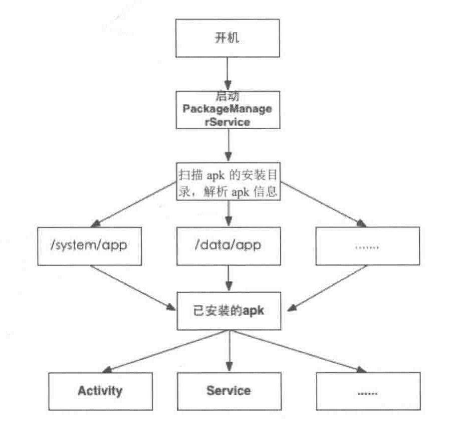

原型模型是一个创建型的模型。原型二字表明了该模式应该有一个样板实例，用户从这个样板对象中复制出一个内部属性一直的对象，这个过程也就是我们俗称的“克隆”。被复制的实例就是我们所称的“原型”，这个原型是可定制的。
使用场景：
* 类实例化需要消耗非常多的资源，这个资源包括数据、硬件资源等，通过原型复制避免这些消化。
* 通过new产生一个对象需要分厂繁琐的数据准备或访问权限，这时可以使用原型模式。
* 一个对象需要提供给其他对象访问，而且各个调用者可能都需要修改其值是，可以考虑使用原型模式复制多个对象工调用者使用，即保护性拷贝。

# Intent的查找与匹配
## 1、APP信息表的构建
PMS启动之后，会扫描系统中安装的APK目录，例如系统APP的安装目录/system/app,第三方应用的目录/data/app,
PMS 会解析apk包下的AndroidManifest.xml文件得到APP的相关信息，而每个AndroidManifext.xml又包含了Activity,Service等组件的注册信息，
当PMS扫描并且解析完这些信息之后就构建好了整个apk的信息书。大致流程如下：

从代码的角度来看看PMS解析已安装apk信息的过程。 对apk的解析工作在构造函数就开始了。

    public PackageManagerService(Context context, boolean factoryTest, boolean onlyCore) {
        EventLog.writeEvent(EventLogTags.BOOT_PROGRESS_PMS_START,
                SystemClock.uptimeMillis());
        // ....
        synchronized (mInstallLock) {
        // writer
        synchronized (mPackages) {
            mHandlerThread.start();
            mHandler = new PackageHandler(mHandlerThread.getLooper());
            // 获取 /data 目录
            File dataDir = Environment.getDataDirectory();
            // 获取 /data/data 目录
            mAppDataDir = new File(dataDir, "data");
            mAsecInternalPath = new File(dataDir, "app-asec").getPath();
            // 获取 /data/user 目录
            mUserAppDataDir = new File(dataDir, "user");
            mDrmAppPrivateInstallDir = new File(dataDir, "app-private");

            sUserManager = new UserManager(mInstaller, mUserAppDataDir);

            readPermissions();

            final HashSet<String> libFiles = new HashSet<String>();

            mFrameworkDir = new File(Environment.getRootDirectory(), "framework");
            mDalvikCacheDir = new File(dataDir, "dalvik-cache");

            boolean didDexOpt = false;

            /**
             * Out of paranoia, ensure that everything in the boot class
             * path has been dexed.
             */
            String bootClassPath = System.getProperty("java.boot.class.path");
            // 加载Framework资源
            libFiles.add(mFrameworkDir.getPath() + "/framework-res.apk");

            String[] frameworkFiles = mFrameworkDir.list();
            
            mFrameworkInstallObserver = new AppDirObserver(
                mFrameworkDir.getPath(), OBSERVER_EVENTS, true);
            mFrameworkInstallObserver.startWatching();
            scanDirLI(mFrameworkDir, PackageParser.PARSE_IS_SYSTEM
                    | PackageParser.PARSE_IS_SYSTEM_DIR,
                    scanMode | SCAN_NO_DEX, 0);

            // 获取系统APP的安装目录 /system/app
            mSystemAppDir = new File(Environment.getRootDirectory(), "app");
            mSystemInstallObserver = new AppDirObserver(
                mSystemAppDir.getPath(), OBSERVER_EVENTS, true);
            mSystemInstallObserver.startWatching();
            // 扫描系统app安装目录
            scanDirLI(mSystemAppDir, PackageParser.PARSE_IS_SYSTEM
                    | PackageParser.PARSE_IS_SYSTEM_DIR, scanMode, 0);

            // Prune any system packages that no longer exist.
            final List<String> possiblyDeletedUpdatedSystemApps = new ArrayList<String>();
           
            // 非核心应用
            if (!mOnlyCore) {
                EventLog.writeEvent(EventLogTags.BOOT_PROGRESS_PMS_DATA_SCAN_START,
                        SystemClock.uptimeMillis());
                mAppInstallObserver = new AppDirObserver(
                    mAppInstallDir.getPath(), OBSERVER_EVENTS, false);
                mAppInstallObserver.startWatching();
                // 扫描第三方APP的安装路径
                scanDirLI(mAppInstallDir, 0, scanMode, 0);
                
            } else {
                mAppInstallObserver = null;
                mDrmAppInstallObserver = null;
            }

        } // synchronized (mPackages)
        } // synchronized (mInstallLock)
    }
    
PMS不仅需要加载系统已安装的各类APK，还要加载Framework，之后开始扫描指定目录下的apk文件进行解析。
    
    private void scanDirLI(File dir, int flags, int scanMode, long currentTime) {
        String[] files = dir.list();
        if (files == null) {
            Log.d(TAG, "No files in app dir " + dir);
            return;
        }

        if (DEBUG_PACKAGE_SCANNING) {
            Log.d(TAG, "Scanning app dir " + dir);
        }

        int i;
        for (i=0; i<files.length; i++) {
            File file = new File(dir, files[i]);
            // 忽略不是apk的文件
            if (!isPackageFilename(files[i])) {
                // Ignore entries which are not apk's
                continue;
            }
           // 解析apk文件
            PackageParser.Package pkg = scanPackageLI(file,
                    flags|PackageParser.PARSE_MUST_BE_APK, scanMode, currentTime);
                    
        }
    }

PackageParser.Package scanPackageLI(File scanFile,int parseFlags, int scanMode, long currentTime) 就是扫描指定的apk文件

    private PackageParser.Package scanPackageLI(File scanFile,
            int parseFlags, int scanMode, long currentTime) {
        mLastScanError = PackageManager.INSTALL_SUCCEEDED;
        String scanPath = scanFile.getPath();
        parseFlags |= mDefParseFlags;
        // 1、包解析器
        PackageParser pp = new PackageParser(scanPath);
        pp.setSeparateProcesses(mSeparateProcesses);
        pp.setOnlyCoreApps(mOnlyCore);
        // 2、解析apk包
        final PackageParser.Package pkg = pp.parsePackage(scanFile,
                scanPath, mMetrics, parseFlags);
        if (pkg == null) {
            mLastScanError = pp.getParseError();
            return null;
        }
        // ....
        // Note that we invoke the following method only if we are about to unpack an application
        // 3、解析apk包中Activity，Service等组件
        PackageParser.Package scannedPkg = scanPackageLI(pkg, parseFlags, scanMode
                | SCAN_UPDATE_SIGNATURE, currentTime);

        return scannedPkg;
    }

### 1、解析apk包pp.parsePackage(scanFile,scanPath, mMetrics, parseFlags);
在上面的代码中首先构建了一个PackageParser的对象pp，之后调用了pp.parsePackage函数：实现如下

    public Package parsePackage(File sourceFile, String destCodePath,
            DisplayMetrics metrics, int flags) {
        mParseError = PackageManager.INSTALL_SUCCEEDED;
        
        XmlResourceParser parser = null;
        AssetManager assmgr = null;
        Resources res = null;
        boolean assetError = true;
        try {
            解析
            pkg = parsePackage(res, parser, flags, errorText);
        } 

        return pkg;
    }

parsePackage解析AndroidManifest.xml的各个节点信息
    
    private Package parsePackage(
        Resources res, XmlResourceParser parser, int flags, String[] outError)
        throws XmlPullParserException, IOException {
        AttributeSet attrs = parser;

        mParseInstrumentationArgs = null;
        mParseActivityArgs = null;
        mParseServiceArgs = null;
        mParseProviderArgs = null;
        // 解析包名
        String pkgName = parsePackageName(parser, attrs, flags, outError);
        
        // 构建Package对象
        final Package pkg = new Package(pkgName);
        boolean foundApp = false;
        // 解析AndroidManifest.xml 中的元素
        TypedArray sa = res.obtainAttributes(attrs,
                com.android.internal.R.styleable.AndroidManifest);
        
        // 版本名，版本号
        pkg.mVersionCode = sa.getInteger(
                com.android.internal.R.styleable.AndroidManifest_versionCode, 0);
        pkg.mVersionName = sa.getNonConfigurationString(
                com.android.internal.R.styleable.AndroidManifest_versionName, 0);
        if (pkg.mVersionName != null) {
            pkg.mVersionName = pkg.mVersionName.intern();
        }
        
        sa.recycle();
        // 默认安装位置
        pkg.installLocation = sa.getInteger(
                com.android.internal.R.styleable.AndroidManifest_installLocation,
                PARSE_DEFAULT_INSTALL_LOCATION);
        pkg.applicationInfo.installLocation = pkg.installLocation;

        
        int outerDepth = parser.getDepth();
        while ((type = parser.next()) != XmlPullParser.END_DOCUMENT
                && (type != XmlPullParser.END_TAG || parser.getDepth() > outerDepth)) {
            if (type == XmlPullParser.END_TAG || type == XmlPullParser.TEXT) {
                continue;
            }

            String tagName = parser.getName();
            
            if (tagName.equals("application")) {
                // 解析Application 标签，Activity,Service等
                if (!parseApplication(pkg, res, parser, attrs, flags, outError)) {
                    return null;
                }
            } else if (tagName.equals("uses-permission")) { // 用户权限
                // .....
            } 
            // .....
        return pkg;
    }

在parseApplication里包含了Activity,Service等，也是Intent所需要的标签。来看一下详细的过程：

    private boolean parseApplication(Package owner, Resources res,
            XmlPullParser parser, AttributeSet attrs, int flags, String[] outError)
        throws XmlPullParserException, IOException {
        // 应用信息
        final ApplicationInfo ai = owner.applicationInfo;
        // 包名
        final String pkgName = owner.applicationInfo.packageName;

        TypedArray sa = res.obtainAttributes(attrs,
                com.android.internal.R.styleable.AndroidManifestApplication);
        // 应用名
        String name = sa.getNonConfigurationString(
                com.android.internal.R.styleable.AndroidManifestApplication_name, 0);
        
        // .....
        final int innerDepth = parser.getDepth();

        int type;
        // 迭代Application下的所有元素
        while ((type = parser.next()) != XmlPullParser.END_DOCUMENT
                && (type != XmlPullParser.END_TAG || parser.getDepth() > innerDepth)) {
            if (type == XmlPullParser.END_TAG || type == XmlPullParser.TEXT) {
                continue;
            }
            
            // 获取标签名
            String tagName = parser.getName();
            //  解析Activity 
            if (tagName.equals("activity")) {
                Activity a = parseActivity(owner, res, parser, attrs, flags, outError, false,
                        hardwareAccelerated);
                if (a == null) {
                    mParseError = PackageManager.INSTALL_PARSE_FAILED_MANIFEST_MALFORMED;
                    return false;
                }

                owner.activities.add(a);

            } else if (tagName.equals("receiver")) {
                Activity a = parseActivity(owner, res, parser, attrs, flags, outError, true, false);
                if (a == null) {
                    mParseError = PackageManager.INSTALL_PARSE_FAILED_MANIFEST_MALFORMED;
                    return false;
                }

                owner.receivers.add(a);

            } 
            //  .....
        }

        return true;
    }
看到Activity、Service、Provider、Receiver等标签是我们心里的石头总算落地了，从parseApplication中我们看到这个过程就是普通的xml解析，根据不同的标签调用不同的解析方法，
例如，解析Activity则会调用parseActivity函数，然后返回Activity实例，然后加到Package对象的activities列表中。

然后我们回到PackageManagerService类中的scanPackageLI的最后一步，也就是调用了scanPackageLI(PackageParser.Package pkg,int parseFlags, int scanMode, long currentTime)

### 2、解析apk包中Activity，Service等组件scanPackageLI(pkg, parseFlags, scanMode| SCAN_UPDATE_SIGNATURE, currentTime);

    private PackageParser.Package scanPackageLI(PackageParser.Package pkg,
            int parseFlags, int scanMode, long currentTime) {
        File scanFile = new File(pkg.mScanPath);
        
        // Initialize package source and resource directories
        File destCodeFile = new File(pkg.applicationInfo.sourceDir);
        File destResourceFile = new File(pkg.applicationInfo.publicSourceDir);

        SharedUserSetting suid = null;
        PackageSetting pkgSetting = null;

        // writer
        synchronized (mPackages) {
            
            int N = pkg.providers.size();
            StringBuilder r = null;
            int i;
         
            N = pkg.services.size();
            r = null;
            for (i=0; i<N; i++) {
                PackageParser.Service s = pkg.services.get(i);
                s.info.processName = fixProcessName(pkg.applicationInfo.processName,
                        s.info.processName, pkg.applicationInfo.uid);
                mServices.addService(s);
                if ((parseFlags&PackageParser.PARSE_CHATTY) != 0) {
                    if (r == null) {
                        r = new StringBuilder(256);
                    } else {
                        r.append(' ');
                    }
                    r.append(s.info.name);
                }
            }
            
            N = pkg.activities.size();
            r = null;
            for (i=0; i<N; i++) {
                PackageParser.Activity a = pkg.activities.get(i);
                a.info.processName = fixProcessName(pkg.applicationInfo.processName,
                        a.info.processName, pkg.applicationInfo.uid);
                mActivities.addActivity(a, "activity");
                if ((parseFlags&PackageParser.PARSE_CHATTY) != 0) {
                    if (r == null) {
                        r = new StringBuilder(256);
                    } else {
                        r.append(' ');
                    }
                    r.append(a.info.name);
                }
            }
            if (r != null) {
                if (DEBUG_PACKAGE_SCANNING) Log.d(TAG, "  Activities: " + r);
            }
            
            pkgSetting.setTimeStamp(scanFileTime);
        }

        return pkg;
    }
    
我们看到了将上一步解析到的Activity，Service添加到了mActivities,mService中，这些类型定义是PackageManagerService的字段，
    
    // 保存所有的Activity节点信息
    final ActivityIntentResolver mActivities = new ActivityIntentResolver();
    // .....
    
到现在整个apk的信息树就建立好了，每个apk的应用名，包名，图标，Activity等信息都存储到系统中，当用户使用Intent跳转到某一个Activity是，系统会在这个信息表中查找，符合要求的组件则会被启动。
这样就通过Intent将系统的各个组件连接起来，使得Android系统成为一个组件可复用、灵活的系统。

## 2、精确匹配

    Activity: startActivity(intent())
    Activity: startActivityForResult (Intent intent, int requestCode, Bundle options)
    Instrumentation: mInstrumentation.execStartActivity(
                        this, mMainThread.getApplicationThread(), mToken, this,
                        intent, requestCode, options);

    Instrumentation .  execStartActivity  
    {
            intent.setAllowFds(false);
            intent.migrateExtraStreamToClipData();
            int result = ActivityManagerNative.getDefault()
                .startActivity(whoThread, intent,
                        intent.resolveTypeIfNeeded(who.getContentResolver()),
                        token, target != null ? target.mEmbeddedID : null,
                        requestCode, 0, null, null, options);
            checkStartActivityResult(result, intent);
            
    }
    
    ActivityManagerService： startActivity
    ActivityStack： startActivityMayWait(caller, -1, intent, resolvedType,
                resultTo, resultWho, requestCode, startFlags, profileFile, profileFd,
                null, null, options, userId);

    startActivityMayWait:
         try {
            // 调用 PMS 的resolveIntent方法 
            ResolveInfo rInfo = AppGlobals.getPackageManager().resolveIntent(intent, null,PackageManager.MATCH_DEFAULT_ONLY| ActivityManagerService.STOCK_PM_FLAGS, userId);
            aInfo = rInfo != null ? rInfo.activityInfo : null;
            aInfo = mService.getActivityInfoForUser(aInfo, userId);
        } catch (RemoteException e) {
            aInfo = null;
        
        }
        
        
    PackageManagerService ：resolveIntent  -> queryIntentActivities
    
     @Override
    public List<ResolveInfo> queryIntentActivities(Intent intent,
            String resolvedType, int flags, int userId) {
        if (!sUserManager.exists(userId)) return null;
        ComponentName comp = intent.getComponent();
        if (comp == null) {
            if (intent.getSelector() != null) {
                intent = intent.getSelector(); 
                comp = intent.getComponent();
            }
        }
        
        // 精确跳转，
        if (comp != null) {
            final List<ResolveInfo> list = new ArrayList<ResolveInfo>(1);
            final ActivityInfo ai = getActivityInfo(comp, flags, userId);
            if (ai != null) {
                final ResolveInfo ri = new ResolveInfo();
                ri.activityInfo = ai;
                list.add(ri);
            }
            return list;
        }

        // 隐式跳转
        synchronized (mPackages) {
            final String pkgName = intent.getPackage();
            if (pkgName == null) {
                return mActivities.queryIntent(intent, resolvedType, flags, userId);
            }
            final PackageParser.Package pkg = mPackages.get(pkgName);
            if (pkg != null) {
                return mActivities.queryIntentForPackage(intent, resolvedType, flags,
                        pkg.activities, userId);
            }
            return new ArrayList<ResolveInfo>();
        }
    }
    
` 总结：在系统启动时PMS会启动，此时PMS将解析所有已安装的应用的信息，构建一个信息表，当用户通过Intent来跳转
到某一个组件是，会根据Intent中包含的信息到PMS中查找对应的组件列表，最后跳转到目标组件中。`
