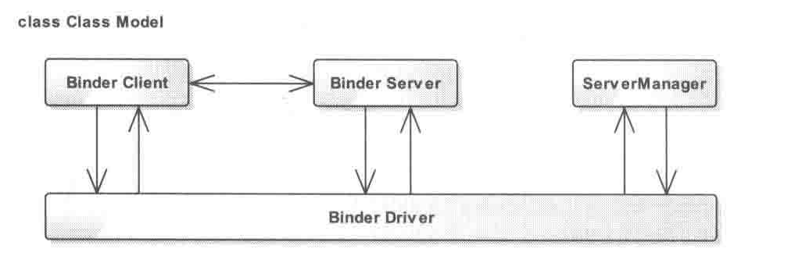

# Android 中的Binder跨进程通信机制与AIDL

## Binder的四个模块

Binder Client，Binder Server，ServerManager和Binder Driver。这4者之间的关系类似于网络访问。Binder Client 相当于我们的客户端PC，Binder Server相当于服务器，ServerManager相当于DNS服务器，而Binder Driver则相当于一个路由器

其中Binder Driver实现在内核空间中，其余三个是现在用户空间

Binder Driver位于内核空间中，其以字符设备中的misc类型注册，用户可以/dev/binder 设备文件节点上，通过open和ioctl文件操作函数与Binder Driver进行通信，
其主要负责Binder通信的建立，以及其在进程间的传递和Binder引用计数管理/数据包的传送等，而Binder Client与Binder Server之间的跨进程通信则统一通过Binder Driver
处理转发，对于Binder Client来说，其只需要知道自己要使用的Binder的名字以及该Binder实体在ServerManager中的0号引用即可，访问的原理也比较简单，Binder Client先是通过0号引用去访问ServerManager获取该Binder的引用，
得到引用后就可以想普通方法调用那样调用Binder实体的方法。最后我们的ServerManager则用来管理Binder Server，Binder Client可以通过它来查询Binder Server接口，刚才我们说到Binder Client可以通过ServerManager来获取Binder的引用，
这个Binder的引用就是由ServerManager来换取的，
这里与其说转换不如说映射更直接，Binder Server在生成一个Binder实体的同时会为其绑定一个名字并将这个名字封装成一个数据包传递给Binder Driver，Binder Driver接收到这个数据包后，如果发现这个Binder是新传递来的，那么就会围棋在内核空间中创建相应的
Binder实体节点和一个对改实体节点的引用，这个实体节点在相应的源码中叫做Binder_node，而其引用则叫做Binder_ref，创建完毕后，Binder Driver就回将该引用传递给ServerManager，ServerManager收到后就会从中取出改Binder的名字和引用插入一张数据表中，这跟DNS中
存储的域名到IP地址的映射原理类似，而对于网络访问来说，而DNS服务器也并不一定对每一个IP地址都有域名映射的记录，我们常常也会碰到直接通过IP地址访问服务器的情况，而Binder也一样冰粉一定要在ServerManager中有记录，很多时候Binder Server会将一个Binder
实体封装进数据包传递给Binder Client，而此时Binder Server会在改数据包中标注Binder实体的位置，Binder Driver则会为该匿名的Binder生成实体节点和实体引用，并将该引用传递给Binder CLient，
那么诱人可能会有疑问，既然ServerManager的作用类似于DNS服务器，那么其本质是不是应该是一个Binder Server才对呢，答案是坑定，ServerManager就是一个标准的Binder Server，并且在Android中约定其在Binder通信的过程中唯一标识（类似于IP地址）永远是0.

    