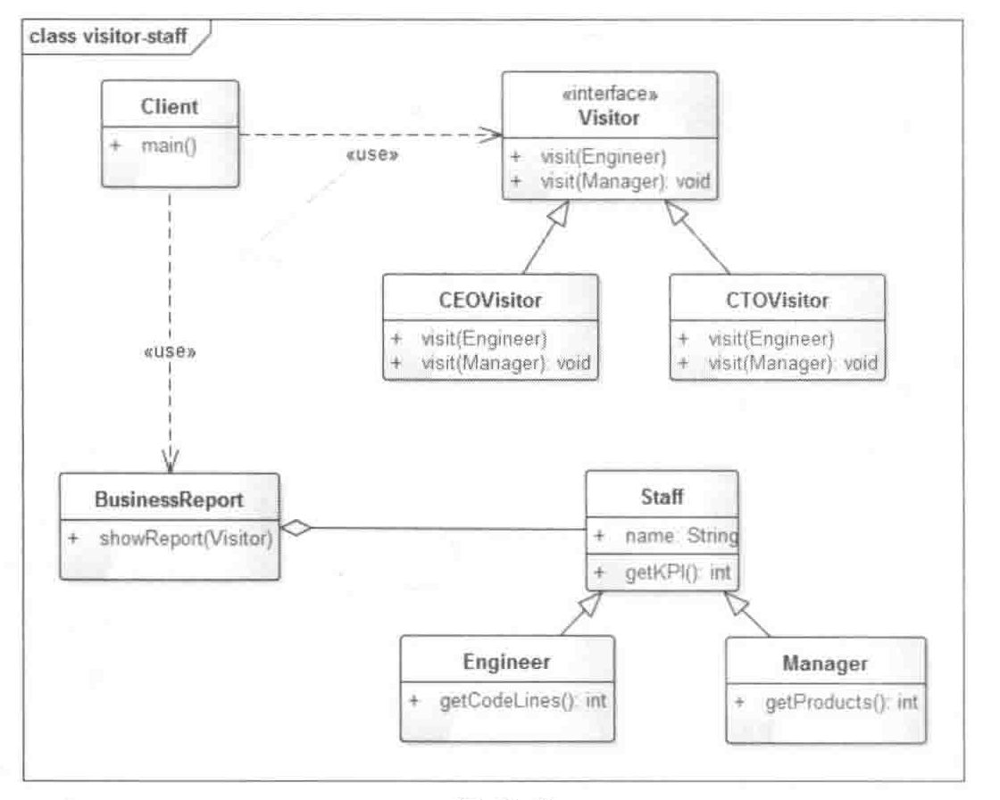

# 访问者模式

在该示例中，CEO只关注Engineer员工的KPI，而对于Manager类型的员工出了KPI之外还有该Manager本年度新开发产品的数量。

* Visitor:接口或者抽象了类，它定义了对每一个元素（Element）访问的行为，它的参数就是可以访问的元素，
它的方法个数理论上来讲与元素个数是一样的，因此，访问者模式要求元素的类族要稳定，如果经常添加、移除元素类，
必然会导致频繁的修改Visitor接口，如果出现这种情况，则说明不适合使用访问者模式。
* ConcreteVisitor:具体的访问者，它需要给出对每一个元素类访问时所产生的具体行为。
* Element:元素接口或者抽象类，它定义了一个接收访问者（accept）的方法，其意义是指每一个元素都要可以被访问者访问。
* ElementA、ElementB:具体的元素类，它提供接受访问方法的具体实现，而这个具体的实现，通常情况下是使用访问者提供的访问该元素类的方法。
* ObjectStructure:定义当中所提到的对象结构，对象结构是一个抽象表述，它内部管理了元素集合，并且可以迭代这些元素供访问者访问。

可以将数据对象与数据操作相分离的效果。
